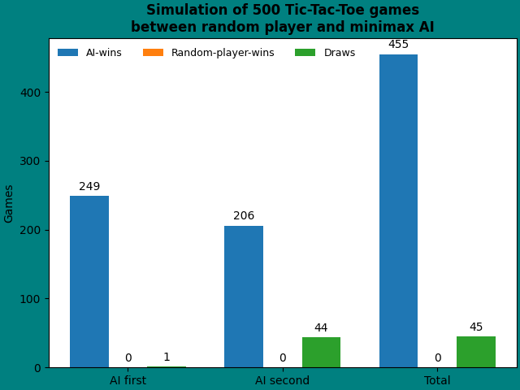

# Tic-Tac-Toe

Simple terminal based Tic-Tac-Toe coded in Python. Game modes include local multiplayer and singleplayer vs the computer (who uses the minimax-algorithm to play).

## How to run
```
pip install -r requirements.txt
python3 TicTacToe.py
```
### MiniMax algorithm
In the singleplayer mode, the computer's moves are determined by the [minimax-algorithm](https://en.wikipedia.org/wiki/Minimax).\
Games between the minimax-computer and random moves are simulated in minimaxTest.py to show that the computer cannot lose. The results of 500 games are as follows:\

